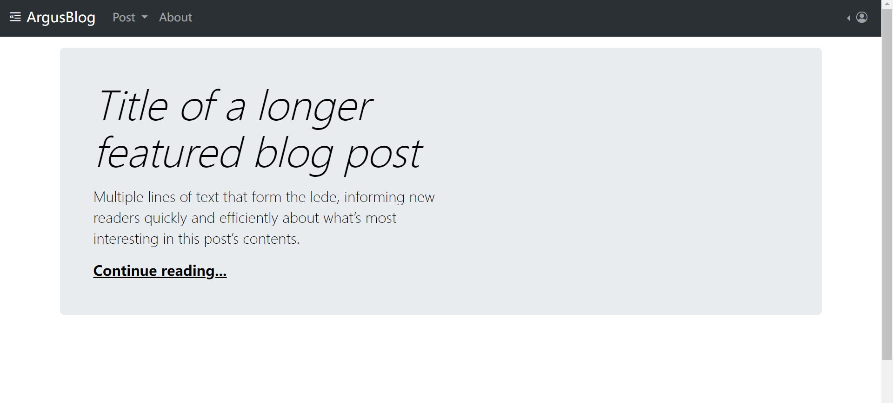

# blog-project

- A project to learn web technique, such as html and django by building an easy blog website.
  - ref: [Udemy - Python and Django Full Stack Web Developer Bootcamp](https://www.udemy.com/course/python-and-django-full-stack-web-developer-bootcamp)

- Functionalities:
  - [x] Post: Crud
  - [x] Comment: Crud
  - [x] User: login, logout
  - [x] User: register
  - [x] User: post mgmt

---

10. Functionality: Board

- [ ] home
- [ ] detail
- [ ] comment

---

## 9. Functionality: Comment

- [x] create
- [x] list
- [x] approve
- [x] delete

---

## 8. Functionality: publish

- [x] publish
- [x] draft_list

---

## 7. Functionality: User

- [x] Signup
- [x] login
- [x] logout

---

## 6. Functionality: Post

- [x] List
- [x] Detail
- [x] Create
- [x] Update
- [x] Delete

---

## 5. Common Web

- [x] Home
- [x] about
- [x] static

---

## 4. Form

- [x] AppBlog.forms.py

---

## 3. Model Design

- [x] AppBlog.models.py

---

## 2. Initiate Project

- [x] Start proejct: ArgusBlog
- [x] Start app: AppBlog

---

## 1. Prerequisite

- [x] Github Repository
- [x] Local Git Clone
- [x] VEnv
- [x] django
